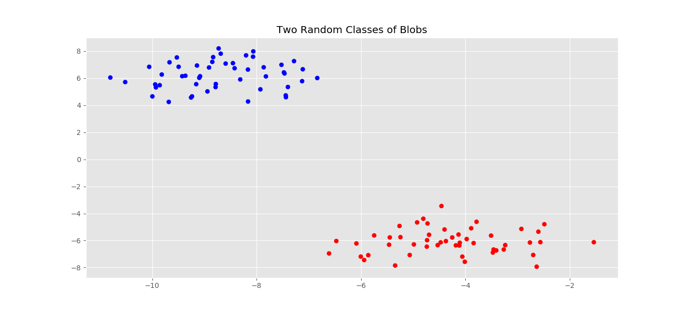
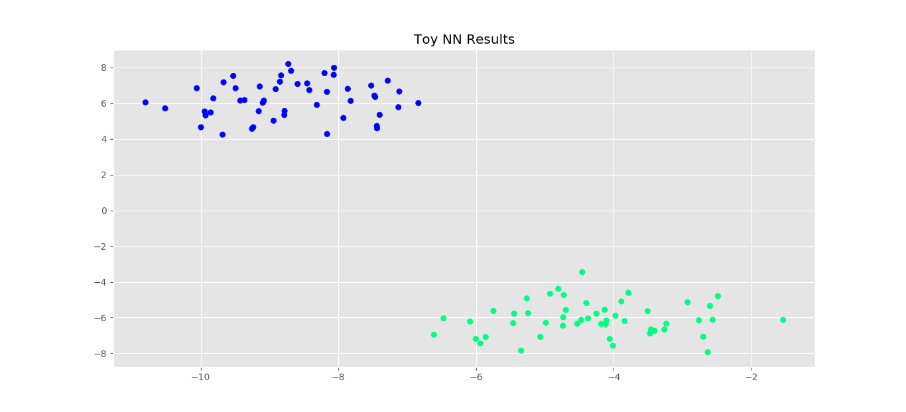

# Toy neural network in numpy - variations

Buidling off the original toy neural network

# blobs.py

### New

- [Generate isotropic Gaussian blobs]
- [Standardize features by removing the mean and scaling to unit variance]
- [Build a text report showing the main classification metrics]

- [Make a scatter plot of x vs y]
- [Make a scatter plot of x vs neural network output]

[Generate isotropic Gaussian blobs]: http://scikit-learn.org/stable/modules/generated/sklearn.datasets.make_blobs.html

[Standardize features by removing the mean and scaling to unit variance]: http://scikit-learn.org/stable/modules/generated/sklearn.preprocessing.StandardScaler.html

[Build a text report showing the main classification metrics]: http://scikit-learn.org/stable/modules/generated/sklearn.metrics.classification_report.html

[Make a scatter plot of x vs y]: https://matplotlib.org/api/_as_gen/matplotlib.pyplot.scatter.html#matplotlib.pyplot.scatter

[Make a scatter plot of x vs neural network output]: https://matplotlib.org/api/_as_gen/matplotlib.pyplot.scatter.html#matplotlib.pyplot.scatter

### Summary

Randomly generated binary classification data set

100 samples, 50 per class, 3 features

Three hidden layers, tanh and sigmoid activation functions

### Plot of data set

 

### Expected Output

