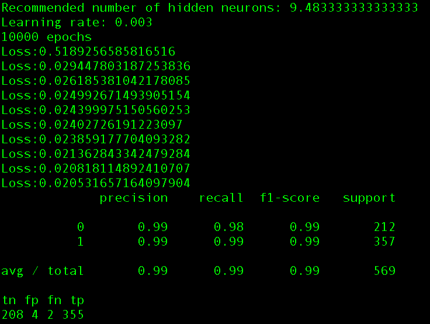
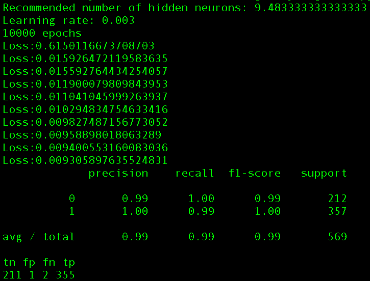

# Overfitting

Adding more to the original toy neural network

### New Additions

Simple Confusion Matrix

ReLu - Rectified Linear Unit

Avoiding overfitting - estimate the upper bounds of hidden layer neurons

### Dataset

Sci-kit Learn copy of [UCI ML Breast Cancer Wisconsin (Diagnostic) dataset]: http://scikit-learn.org/stable/modules/generated/sklearn.datasets.load_breast_cancer.html

### Results

tanh.py

relu.py

